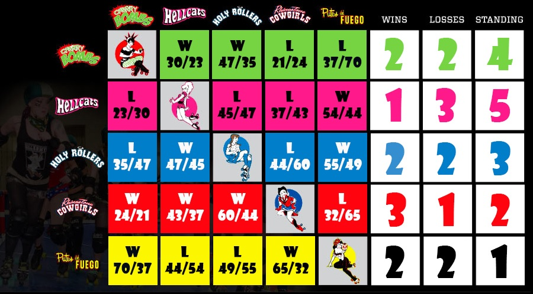
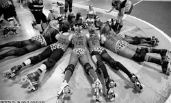
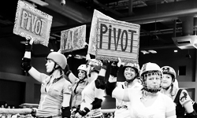
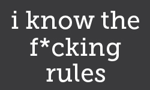

<h4> How is your team doing </h4>

            

                <h4> Membership Points </h4>
                  
                  </a>
            
<!--end div class column large-3-->    

            

                   <h4> Practice Points </h4>
                      
                      </a>
            
<!--end div class column large-3-->   
            
            

                   <h4> Business Documents </h4>
                      
                      </a>
            
<!--end div class column large-3-->   

            

                   <h4> Upcoming Events </h4>
                      
                      </a>
            
<!--end div class column large-3-->  

 <!--end div class row-->